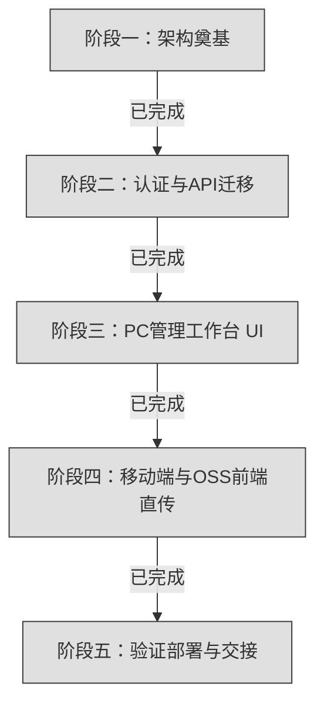

# WeldSnap V2.0 全局重构路线清单 (Roadmap)

> [!NOTE]
> 本路线图规划了 WeldSnap 从 Express + SQLite 的单机系统，全面重构为云原生 Next.js App Router + 阿里云 OSS 直接上传 + Pino/ALS 全链路可观测性系统的演进阶段与核心任务。目前系统已完成全部阶段重构与收尾交接。

---

## 🗺️ 重构阶段总览

> **系统状态**：V2.0 阶段一至阶段五全量功能与接口均已完成上线验证与生产构建交接。

---

## 📋 阶段任务拆解

### 阶段一：架构奠基（已完成）
* **核心内容**：设计现代 Next.js 15 生产级目录结构，搭建底层基础设施。
* [x] **目录设计**：梳理并输出 `src/app`、`src/lib`、`src/services` 的分层结构。
* [x] **依赖管理**：配置 `package.json`（引入 Next.js 15、Tailwind CSS v4、Pino 及 ali-oss，排除 Express/Multer 等冗余依赖）。
* [x] **全链路日志引擎**：配置 Pino 日志，挂载 AsyncLocalStorage 实现跨异步调用自动注入 traceId，并配置关键安全凭证脱敏规则。
* [x] **数据库原生挂载**：移植原有的 `db.js` SQL 结构，封装内置 `node:sqlite` 操作，并解决 Webpack 针对 `node:` 协议的打包异常。
* [x] **高阶包装器与签名接口**：实现 `withTrace` 路由包装器，提供首个核心 API：`POST /api/upload/sign`。

### 阶段二：认证体系与全量 API 迁移（已完成）
* **核心内容**：重写认证与全部后台逻辑，升级为云原生文件流管理。
* [x] **内置加密 Session**：使用 Node.js 的 `crypto` 模块实现 AES-256-GCM 加密 Cookie 会话，避免额外依赖，保证 12 小时安全维持。
* [x] **权限拦截守卫**：提供 `requireAuth` 与 `requireAdmin`，校验失败时抛出带 status 码的业务异常，由 `withTrace` 转化为 401/403 客户端响应。
* [x] **REST API 全量迁移**：平移全套登录、列表、搜索、数据导入（Excel 解析）API 到 Next.js API Routes。
* [x] **云端照片目录遍历**：重构 `/api/admin/export-folder`，调用 OSS SDK 的 list 方法，将扁平的 OSS 相对路径对象自动组织成树状 JSON，保持与 V1 前端高度兼容。
* [x] **直链重定向下载**：重构 `/api/admin/download`，通过 302 临时重定向直接分发 OSS 60s 短效签名下载链接，免去 Node 进程中转负荷。

### 阶段三：PC 管理工作台与登录页（已完成）
* **核心内容**：落实 IBM Carbon 视觉风格，实现高信息密度的后台主控制台。
* [x] **字形与令牌配置**：引入谷歌 `IBM Plex Sans` (Display 使用 Light/300 字重) 与 `IBM Plex Mono`，配置绝对矩形与无阴影色彩分层。
* [x] **扁平登录组件**：实现 IBM Carbon 经典的底线输入框（Bottom-Border Input）及全矩形 Primary 按钮。
* [x] **左侧 1/4 导航树**：Gray 10 纯色分层填色，渲染管线号（pipeline_no）树，点击支持右侧工作区联动。
* [x] **右侧 3/4 工序进度矩阵**：
  * 技术性无纵向网格线紧凑表格。
  * **工序状态单元格可视化**：已完成（10% 绿底 + 深绿文字，显示 `已上传(姓名)`），待录入（10% 暖沙底 + 灰字，显示 `未上传`）。
* [x] **悬浮照片预览 (Hover Preview)**：鼠标悬停在 `已上传` 标签时，前端即时加载带有 OSS GET 短效签名的缩略图气泡，秒级复核（采用 fixed 视口定位并随鼠标位移，防溢出）。

### 阶段四：移动端与 OSS 前端直传（已完成）
* **核心内容**：手机端交互适配与大体积照片的前端本地压缩直传。
* [x] **手机端自适应布局**：采用大触控目标排版，支持施工员在嘈杂现场戴手套轻松点触拍照。
* [x] **Canvas 前端抢跑压缩**：拦截拍照后的原始 File，就地进行等比缩放调优（上限 1920x1080）与 0.8 JPEG 质量压缩，将 5-10MB 的原图就地缩减至 500KB 以内。
* [x] **OSS 前端直传**：获取预签名 URL，手机端直接 PUT 传输大文件流到 OSS。
* [x] **状态轻量变更同步**：直传 OSS 成功（200）后，向 Next.js 服务端发送确认请求，服务器仅更新数据库对应字段。

### 阶段五：验证部署与交接（已完成）
* **核心内容**：全面集成测试、致远 OA DEE 接口同步、CI/CD 构建及独立 standalone 生产部署。
* [x] **遗留安全加固**：重构 `/api/upload/sign` 接口，使用 `requireAuth` 鉴权代替简易的 token 检查，封堵未授权获取 OSS 直传签名的安全漏洞。
* [x] **CI/CD 流更新**：修改 `.github/workflows/deploy.yml`，以 standalone 模式构建打包，配置生产运行环境与日志文件夹持久挂载。
* [x] **致远 OA DEE 接口对接与文档编制**：完成 `POST /api/sync/projects`（项目批量同步）与 `POST /api/sync/projects/status`（完工状态更新）接口，编写 Groovy 脚本解包指南与完整文档。
* [x] **全业务审计日志埋点**：完成所有接口及简易登录、更新姓名、数据导入出场景下 Level 35 (`audit`) 日志覆盖与筛选导出。
* [x] **端到端流程验证与收尾**：完成从 Excel 导入、扫码、设备指纹登录、拍照、前端直传 OSS、后台明细展现、历史目录树预览到直链重定向下载的全链路闭环验证。
