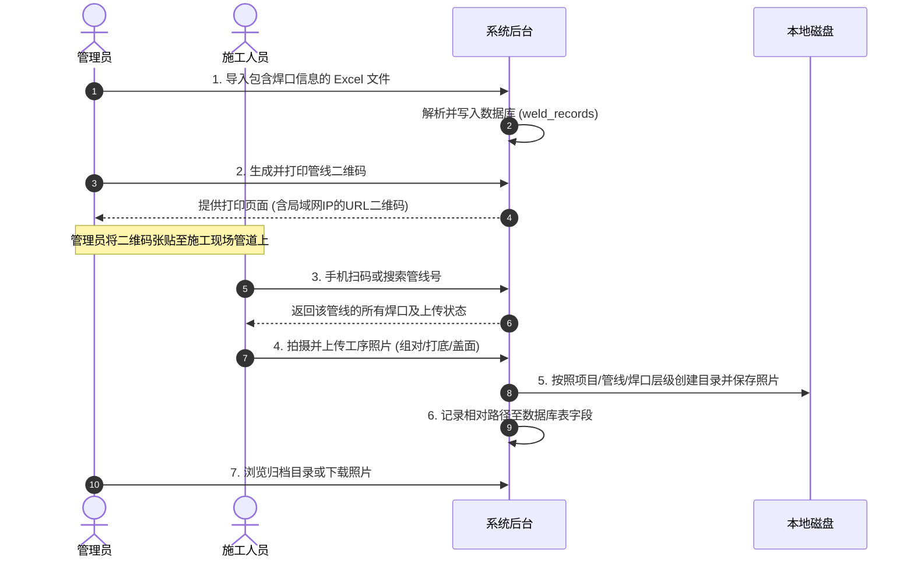

# WeldSnap 项目接手与开发指南

> [!WARNING]
> 本文档是 V1 或迁移过程中的历史资料，不是当前运行规范。当前实现以 `src/`、`package.json` 和 `.github/workflows/deploy.yml` 为准；其中旧的 Express、本地 `exports/`、旧会话或旧 OSS 路径说明仅供追溯。


> [!NOTE]
> 本文档旨在为新接手 **管道焊口工序照片录入系统 (WeldSnap)** 的开发与维护人员提供快速上手指引。内容涵盖技术栈梳理、设计思路、系统架构、当前功能完备度评估以及后续开发建议。

---

## 1. 技术栈梳理 (Technology Stack)

该项目采用极简、轻量、低依赖的设计原则，旨在实现快速部署和开箱即用。

### 1.1 后端 (Backend)

- **运行时环境**：Node.js（项目使用原生 `node:sqlite` 模块，需在支持该模块的 Node.js 稳定版本下运行，如 v22.x+，或通过 `--experimental-sqlite` 参数启动）。
- **Web 框架**：[Express.js](https://expressjs.com/) (v4.21.0) —— 用于提供 API 接口服务和托管前端静态资源。
- **数据库**：SQLite（直接使用 Node.js 的内置原生同步数据库模块 `DatabaseSync`，无需外部关系型数据库服务及驱动库）。
- **文件上传**：`multer` —— 拦截客户端照片上传，通过内存 buffer 缓冲，再使用 `fs` 写入磁盘。
- **二维码生成**：`qrcode` —— 用于将页面 URL（包含局域网 IP）转换为 Base64 格式的 DataURL 二维码。
- **数据导入**：`xlsx` —— 用于解析施工单位提供的 Excel 焊口基础信息表。
- **安全认证**：
  - `bcryptjs` —— 用于管理员及施工人员密码的哈希加密与校验。
  - `express-session` —— 基于内存/Cookie 存储的简单会话管理。

### 1.2 前端 (Frontend)

- **UI 框架**：无（基于纯原生 HTML/CSS/JavaScript，使用 Vanilla JS 直接操控 DOM）。
- **样式方案**：原生 CSS 编写，适配桌面端与移动端浏览器（响应式布局）。
- **核心页面与脚本**：
  - 管理后台：[admin.html](file:///c:/Users/gaoft/Documents/CodeSpace/WeldSnap/public/admin.html) + [admin.js](file:///c:/Users/gaoft/Documents/CodeSpace/WeldSnap/public/js/admin.js)
  - 照片上传：[upload.html](file:///c:/Users/gaoft/Documents/CodeSpace/WeldSnap/public/upload.html) + [upload.js](file:///c:/Users/gaoft/Documents/CodeSpace/WeldSnap/public/js/upload.js)
  - 登录入口：[login.html](file:///c:/Users/gaoft/Documents/CodeSpace/WeldSnap/public/login.html) + [login.js](file:///c:/Users/gaoft/Documents/CodeSpace/WeldSnap/public/js/login.js)
  - 打印排版：[qrcodes-print.html](file:///c:/Users/gaoft/Documents/CodeSpace/WeldSnap/public/qrcodes-print.html)

---

## 2. 设计思路与核心业务流 (Design & Business Flow)

### 2.1 业务场景与核心痛点

本系统应用于**石化/管道大修现场**的焊口工序照片采集。

- **传统痛点**：现场拍照后，施工员需回传并人工按 “项目-管线-焊口-工序” 重命名并分类建档，工作量大且极易出错。
- **解决思路**：
  1. **二维码绑定**：将管线号编码为二维码，张贴在施工现场对应的管道上。
  2. **扫码即录入**：工人扫描二维码，手机端浏览器自动打开录入页面，自动带出管线号。
  3. **工序闭环**：施工员在手机端下拉选择对应的焊口，直接调用手机摄像头拍摄并上传 **组对、打底、盖面** 3 道关键工序照片，由系统自动重命名并归档。

### 2.2 核心业务流图



---

## 3. 系统架构与关键实现 (System Architecture)

### 3.1 目录结构说明

```
WeldSnap/
├── .github/workflows/   # CI/CD 自动化部署流
├── config.json          # 全局配置文件 (保存导出根路径及端口号)
├── db.js                # 数据库核心逻辑 (表初始化、增删改查 SQL)
├── server.js            # Express 主服务端 (API 路由、静态托管、文件上传拦截)
├── package.json         # 依赖及启动命令
├── data/
│   └── app.db           # SQLite 数据库文件 (运行时自动创建)
├── docs/                # 文档目录
├── exports/             # 默认的照片导出根目录 (按规则自动生成子文件夹)
└── public/              # 前端静态资源
    ├── css/
    │   └── style.css    # 核心样式文件
    ├── js/
    │   ├── admin.js     # 后台交互逻辑
    │   ├── login.js     # 登录页逻辑
    │   └── upload.js    # 手机上传端逻辑
    ├── admin.html       # 管理后台页面
    ├── login.html       # 登录页面
    ├── upload.html      # 上传页面
    └── qrcodes-print.html # 二维码批量打印排版页
```

### 3.2 数据库设计 (`data/app.db`)

系统包含两个核心表，结构如下：

#### 用户表 (`users`)

保存管理员和施工人员的身份信息：

* `id` (INTEGER, 主键, 自增)
* `username` (TEXT, 唯一约束, 用户名)
* `password_hash` (TEXT, 密码哈希值)
* `role` (TEXT, 默认 'worker', 角色: admin / worker)
* `display_name` (TEXT, 显示名称)
* `created_at` (TEXT, 创建时间)

#### 焊口记录表 (`weld_records`)

保存管线与焊口工序照片的关联状态：

* `id` (INTEGER, 主键, 自增)
* `seq_no` (TEXT, 序号)
* `project_name` (TEXT, 项目名称)
* `construction_no` (TEXT, 施工号)
* `project_no` (TEXT, 项目号)
* `pipeline_no` (TEXT, 管线号)
* `weld_no` (TEXT, 焊口号)
* `photo_zudui` (TEXT, 组对照片的相对存储路径)
* `photo_dadi` (TEXT, 打底照片的相对存储路径)
* `photo_gaimian` (TEXT, 盖面照片的相对存储路径)
* `uploaded_by` (TEXT, 最后上传人员的显示名)
* `uploaded_at` (TEXT, 最后上传时间)
* **唯一约束**：`UNIQUE(pipeline_no, weld_no)` —— 保证同一条管线下的焊口号不重复。

### 3.3 照片命名与磁盘存储结构

照片保存至指定的 `exportRoot`（默认为程序目录下的 `exports/` 目录），并按照项目信息动态建档：

- **物理文件夹结构**：
  `{exportRoot}/{项目名称}_{施工号}_{项目号}/{管线号}/{焊口号}/`
- **照片文件命名**：
  `{管线号}-{焊口号}-{工序名称}.jpg` （其中工序名称为：组对、打底、盖面）
- **数据库记录**：
  表内对应的照片路径字段（如 `photo_zudui`）仅存储相对于 `exportRoot` 的**相对路径**（例如：`项目A_施工01_项目号01/管线01/焊口01/管线01-焊口01-组对.jpg`），以方便在修改导出根路径时，文件检索逻辑依然自适应。

---

## 4. 功能开发情况评估 (Feature Status)

### 4.1 已实现功能

- [X] **身份认证**：管理员与普通工人的登录/登出，基于 Session 会话拦截（12 小时免登）。
- [X] **数据导入**：支持 Excel 批量导入，配置了灵活的表头模糊匹配算法（兼容不同格式的表头命名）。
- [X] **二维码生成与打印**：自动检测服务端局域网 IP 并生成带参二维码；支持打印页排版。
- [X] **照片扫码/手动录入**：支持扫码带参识别或手动搜索识别管线号；按焊口及工序上传照片，手机端可唤起摄像头。
- [X] **管理员覆盖与重传**：实现了管理员在后台对已有工序照片进行重新上传覆盖的权限逻辑。
- [X] **系统设置与路径浏览**：支持动态更改导出根路径，支持在后台安全地浏览服务器本地磁盘目录以选择新路径。
- [X] **全局基本统计**：提供焊口总量、已完工量、未完工量看板。

### 4.2 潜在不足与技术债务

- [ ] **照片未压缩（带宽与存储瓶颈）**：目前照片通过 Multer 原样保存，手机直传照片（通常 3-10MB）易占满服务器磁盘，且弱网环境下上传极慢。
- [ ] **局域网多网卡冲突**：自动检测局域网 IP 时仅粗暴抓取第一个非 internal 的 IPv4 地址。如果服务器开启了虚拟机网卡或 VPN，生成的二维码链接可能会失效。
- [ ] **数据库与磁盘文件一致性**：写盘与写库非事务绑定。若在上传过程中崩溃，可能会出现“有文件无记录”或“有记录无文件”的情况。
- [ ] **并发性能限制**：由于使用了 Node.js 原生的 `DatabaseSync` 同步数据库操作接口，高并发上传或大文件导入时会阻塞 Node.js 主线程。
- [ ] **历史路径迁移兼容性**：在「系统设置」中修改 `exportRoot` 后，历史已上传照片仍在旧目录中，在后台预览时会因找不到相对路径而显示 404，需人工搬迁文件。

---

## 5. 建议的着手点 (Recommended Next Steps)

建议您按以下阶段逐步熟悉并改造系统：

### 第一阶段：本地跑通与流程体验

1. 检查本地 Node.js 版本（建议保持在 v22.x 以上稳定版），执行 `pnpm install` 安装依赖。
2. 启动服务（`pnpm start`），通过后台新建一个普通工人账号。
3. 模拟一份包含焊口数据的 Excel 模板并导入。
4. 用手机（或浏览器调试模式模拟移动端）连接同一局域网，扫码/输入管线号，进行照片拍照上传，观察 `exports/` 目录下的变化。

### 第二阶段：重点缺陷修复与优化

1. **图片前端压缩（高优先级）**：
   - 建议在 [upload.js](file:///c:/Users/gaoft/Documents/CodeSpace/WeldSnap/public/js/upload.js) 中加入 Canvas 压缩逻辑，将上传的照片在前端预压缩至合适的分辨率和大小（如 1MB 以内），极大缓解现场局域网弱网上传慢和服务器存盘压力。
2. **局域网 IP 可选配置**：
   - 目前 IP 自动生成，如果识别有误只能手动修改代码。建议将局域网 IP 写入 [config.json](file:///c:/Users/gaoft/Documents/CodeSpace/WeldSnap/config.json) 或在系统设置中允许管理员手动指定服务绑定的主 IP。
3. **二维码打印排版美化**：
   - 目前批量打印页（[qrcodes-print.html](file:///c:/Users/gaoft/Documents/CodeSpace/WeldSnap/public/qrcodes-print.html)）排版较为简易。可在 CSS 中加入分页符控制（`page-break-after: always;`），使其打印时更加规整。

### 第三阶段：重构与长期维护

1. **统一的错误拦截与日志记录**：
   - 建议在 `server.js` 引入统一的错误处理中间件，并使用 `winston` 或类似工具将日志输出到文件中，方便排查现场部署问题。
2. **迁移至异步 SQLite**：
   - 在高并发需求明确时，将 `db.js` 重构为异步数据库查询，避免大批量上传时导致的 API 卡顿。
